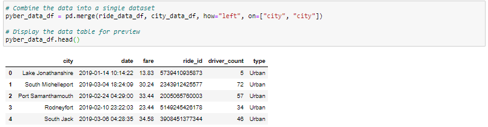
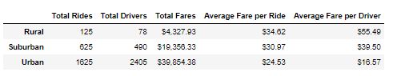
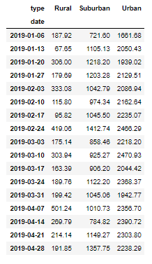
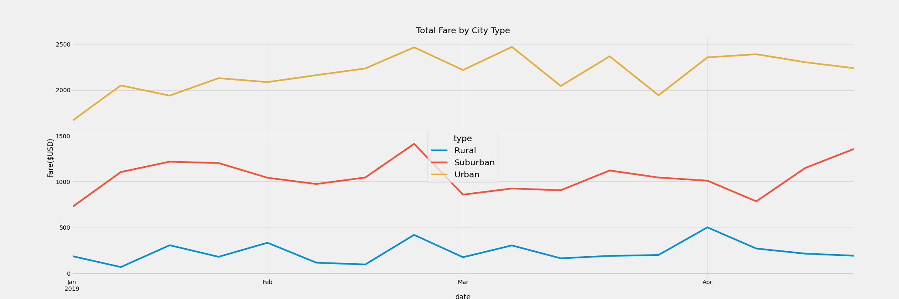

# DABC_PyBer_Analysis

The purpose of the analysis is to gain insights in the ride sharing data by visualizing the trends of the total fares for 3 city types of which the company, PyBer, operates in: Urban, Suburban, and Rural.

## Resources

- Data source: city_data.csv, ride_data.csv
- Software: Python, Jupyter, Anaconda, Pandas, and Matplotlib.

## Results:

The analysis is performed by first merging the two datasets, city_data and ride_data, into one data frame where the city specific data is added to the dataset for each ride, as illustrated below:

- Merged Data Frame
</img>

From this merged dataset, we are able to calculating the Total Rides, Total Drivers, Total Fares, Average Fare per Ride, and Average Fare per Driver for each city type by grouping the the merged dataset by city type. As shown in below screenshot,rural cities have the least amount of rides and drivers, but the highest average fare per ride and per driver. In contrast to rural cities, urban cities have the highest amount of rides and drivers, but the lowest average fare per ride and per driver.

- Average Fare by City Type Summary
</img>

From the merged dataset, we are also able to analyze the trend of the total fares for each city type by grouping the merged dataset by city type and date, and reframing the dataset to show the total fares by week, and plot the data in a line graph:

- Total Fare by City Type by Week

</img>

- Total Fare by City Type
</img>

As shown in the above line graph, although urban cities have the lowest average fare per driver and per ride, it becomes clear that it actually generates the most revenue for the company as it is consistently outperforming suburban cities and rural cities from January to April in terms of total fare. In addition, demand for ride sharing is more stable in urban cities than in suburban and rural cities. Although all 3 city types have shown a dip in total fare after the week of Feb 24, the drop in total fare for urban cities is less severe. Although the total fare may fluctuate week over week, it is consistently generating over $2,000 every week (with the exception of the last week of March, which was slightly below $2,000). On the other hand, total fare for suburban cities peaked at $1412.74 for the week of Feb 24, which then reflected large drop and hovered around the same range of about $1,000 per week for the entire month of March, until demand takes off in mid-April. Lastly, although rural cities have the highest average fare per ride and per driver, it fails to generate more than $500 per week.

## Summary: 
Based on the insights gained from the above analysis, it is highly recommended that the company consider the following strategies:

(1) Urban cities should be the top focus of the company as it generates the most revenue despite the lowest average fare per driver and per ride. This is largely due to the demographics of urban cities where population density is much higher in comparison to suburban and rural cities. Therefore, demand for ride sharing is generally much higher in urban cities. In addition, the benefits of demand-side economies of scale, or network effect, plays a key role in helping the company grow. The more users choose to ride with PyBer, the more attraction PyBer gets, which would induce more users to ride with PyBer. Hence, the company can afford to lower the charge per ride in urban cities while gaining more revenue by attracting more riders.

(2) The company should also pay attention to its policy in suburban cities, where demand seems to have struggled to generate fares around the range of $1,000 per week, but has also shown its potential to contribute more. For example, total fare peaked in February, and in the last week of April. This could be due to seasonal factors where demand increases every two months. It is recommended that the company collect data when users ride with PyBer regarding the purpose of the trip. This will allow the company to gain insights into the reason for the fluctuation in demand. It is possible that stronger advertisement and lower charges could induce higher permenant demand in suburban cities.

(3) The company should pay the least attention to rural cities. Although it has the higher Average Fare per Driver and per Ride, the demand for ride sharing in rural cities is insufficient to contribute a significant amount of revenue for the company. However, the company can also consider increasing the charge per ride in rural cities. This is because most people would likely have cars as means of transportaion in rural cities, in contrast to urban cities. Therefore, if users choose to ride with PyBer, there must be a compelling reason to do so. As long as the charges are lower than the alternative of buying a car, PyBer can afford to increase the charge and therefore increase total fares from rural cities.